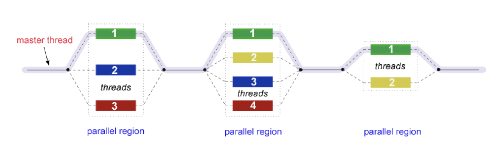
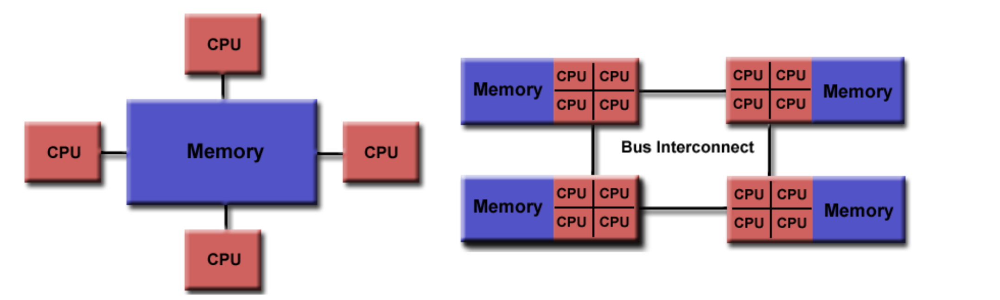

# OpenMP


## What is OpenMP?
OpenMP (Open Multi-Processing) is an Application Programming Interface (API) designed to enable explicit multi-threaded, shared memory parallelism in C, C++, and Fortran programs. OpenMP is widely used for programming on shared memory architectures, where multiple processor cores can access a common memory space.

## OpenMP API Components
OpenMP consists of three primary API components:

1. **Compiler Directives**: Special instructions embedded in the source code to control parallel execution (e.g., `#pragma omp parallel` in C/C++).
2. **Runtime Library Routines**: Functions (e.g., `omp_get_thread_num()` in `omp.h`) to manage threads, set parameters, and query the execution environment.
3. **Environment Variables**: External variables (e.g., `OMP_NUM_THREADS`) to control OpenMP behavior at runtime.

## Key Features and Programming Model

### Fork-Join Model


This is the core model of how OpenMP runs your code. The master thread forks additional threads at the start of a parallel region; all threads join back at the end.

**Process:**
1. **Start**: Your program starts with one thread – the master.
2. **Fork**: When it hits a parallel region, the master creates a team of threads.
3. **Work**: All threads in the team run the parallel code together.
4. **Join**: After the parallel region, all threads finish and disappear, leaving only the master thread.

This pattern repeats throughout the program.

### Shared Memory


- All threads can access shared global memory, but also have private local memory.
- One copy of the data is shared among threads.
  
Can be implemented on both:
- **UMA (Uniform Memory Access)**: Equal memory access speed for all CPUs.
- **NUMA (Non-Uniform Memory Access)**: Access time depends on memory location relative to the CPU.

### Work Sharing
OpenMP provides constructs to divide tasks among threads (e.g., `for`, `sections`, `single`, `master`).

### Synchronization
Mechanisms like barriers, critical sections, and atomic operations are provided to coordinate threads and avoid race conditions.

### Incremental Parallelization
Programmers can parallelize code incrementally, adding directives to serial programs as needed.

### Portability
The API is standardized and supported on most major platforms, including Unix/Linux and Windows.

## What OpenMP Is NOT

It's not perfect, and the programmer still has responsibilities:

- **Different vendors** may implement it differently.
- **Doesn't guarantee optimal performance** - you still need to optimize your code.
- **Doesn't automatically check for**:
  - Data races
  - Deadlocks
  - Invalid code
- **Doesn't handle file I/O synchronization** - you must manage it yourself.

## Goals of OpenMP

| Goal            | Description |
|-----------------|------------|
| Standardization | A common way to write parallel code across many platforms. |
| Lean and Mean   | Originally designed to use just a few simple directives (3–4). |
| Ease of Use     | Allows gradual (incremental) parallelization of existing code. |
| Portability     | Works with C/C++ and Fortran on many OSes (Unix, Linux, Windows). |

## How to Enable OpenMP in Your Compiler

To use OpenMP, you must pass a special flag to the compiler during compilation. Here are the flags for each major compiler:

| Compiler | Platform       | Command Example       | OpenMP Flag   |
|----------|----------------|-----------------------|---------------|
| Intel    | Linux          | icc, icpc, ifort      | `-qopenmp`    |
| PGI      | Linux          | pgcc, pgf77, pgf90    | `-mp`         |
| GNU      | Linux / IBM BlueGene | gcc, g++, gfortran | `-fopenmp`    |
| IBM XL*  | Coral Systems  | xlc_r, xlf_r (must end in _r for thread-safe) | `-qsmp=omp` |

## Example (C code using GCC):
```bash
gcc -fopenmp myprogram.c -o myprogram