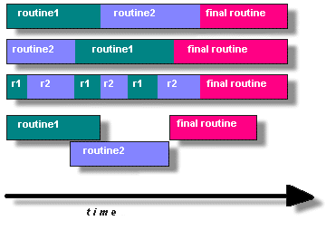
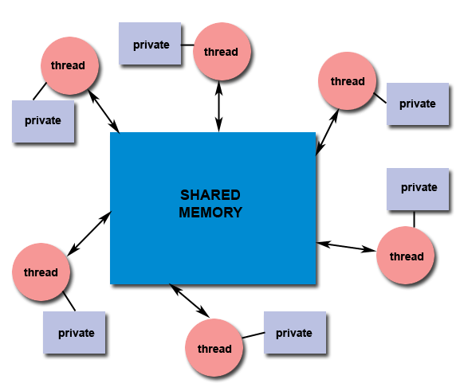
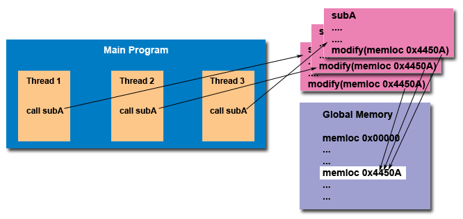
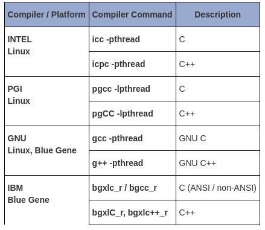

# Pthreads Overview

## What is a Thread?

A **thread** is an independent stream of instructions that can be scheduled by the operating system. It represents a “procedure” that runs independently from its main program.

In a **multi-threaded** program, multiple procedures (threads) can run simultaneously and/or independently.

## Process vs Thread (UNIX Perspective)

### Process:
A **UNIX process** is created by the OS and requires a fair amount of “overhead”. Processes contain information about program resources and program execution state, including:
- Process & user ID
- Environment variables
- Working directory
- Program instructions
- CPU state (registers, etc.)
- Memory (stack & heap)
- File descriptors
- Signal handling
- Shared libraries
- IPC info (pipes, semaphores, etc.)

### Thread:
A **thread**:
- Exists **within** a process
- Has its own **control flow**
- Is **lightweight**, holding only essential resources:
  - Stack pointer
  - Registers
  - Scheduling properties (priority, policy)
  - Blocked/pending signals
  - Thread-specific data
- Shares the **process's resources** with other threads

## Key Characteristics

- Threads **share memory and resources** of their parent process.
- Threads are independently **schedulable** by the OS.
- Threads require **synchronization** when accessing shared data.

## Implications of Shared Resources

- **Changes** by one thread (e.g., closing a file) affect others.
- **Pointers** with the same value refer to the same memory.
- **Read/write operations** on shared memory must be synchronized to avoid race conditions.

## What are Pthreads?

**Pthreads** (POSIX threads) are a standardized set of C programming interfaces for creating and managing threads on UNIX systems.

## Why Pthreads?

- Historically, different hardware vendors implemented **proprietary threading APIs**, causing **portability issues**.
- A **standard interface** was needed for cross-platform thread development.

## POSIX Standard

- Defined by **IEEE POSIX 1003.1c (1995)**.
- Pthreads adhere to this standard.
- Most modern UNIX systems support **Pthreads** along with any proprietary thread APIs.

## Key Characteristics

- Implemented via:
  - `pthread.h` header file
  - A thread **library** (may be standalone or part of `libc`)
- Consists of:
  - C **data types**
  - C **function calls** for thread creation, synchronization, and management

## Why Pthreads?

## 1. Lightweight

Threads are **more lightweight** compared to processes. They require **less overhead** from the operating system to create and manage.

### Performance Comparison

> ✅ **Conclusion**: `pthread_create()` is significantly faster than `fork()`.

## 2. Efficient Communication & Data Exchange

- **Threads share memory** within a process, allowing **zero-copy data exchange** via pointers.
- **MPI** (used in HPC) requires memory copies even in shared memory mode.
- **Pthreads** eliminate this need, providing **higher efficiency**, especially on-node.
- Worst-case: communication reduced to **cache-to-CPU/memory-to-CPU bandwidth**, which is still faster than MPI shared memory.

## 3. Additional Benefits of Threading

- **Overlapping CPU and I/O**:
  - One thread can perform computation while another waits for I/O.

- **Priority/Real-time Scheduling**:
  - Higher priority threads can **preempt** lower priority ones.

- **Asynchronous Event Handling**:
  - Threads allow efficient **handling of unpredictable events**.

## 4. Real-world Examples

- **Web browsers**: Downloading, rendering, and handling input happen in parallel.
- **Modern operating systems**: Use threads extensively to manage concurrent tasks efficiently.

# Designing Threaded Programs

## Why Use Threads for Parallel Programming?

Modern computers have **multiple cores**, so we can run parts of a program at the same time using **threads**. This is called **parallel programming**.

To benefit from Pthreads, your program should have **independent tasks** that can run **concurrently** (at the same time).

## ✅ Good Use Cases for Threads

Threads are useful when your program:

- Waits for long I/O (like reading files or waiting for user input)
- Uses a lot of CPU in some parts
- Needs to handle **unexpected events** (like incoming messages)
- Has **high-priority work** that must be done immediately

## Common Threading Models

1. **Manager/Worker**  
   - A **manager** thread assigns work to **worker** threads.  
   - Two types:  
     - Static (fixed number of workers)  
     - Dynamic (workers created as needed)

2. **Pipeline**  
   - Work is split into steps, each handled by a different thread.  
   - Like a factory assembly line.

3. **Peer**  
   - All threads (including the creator) do the work together.

## Shared Memory Model

- All threads **share the same global memory**.
- But each thread also has its **own private data**.
- You (the programmer) must **protect shared memory** to avoid problems.

## Thread-Safeness

- Some functions or libraries are **not thread-safe** (they don’t work properly if used by many threads at once).
- If you're unsure whether a function is thread-safe:
  - ❌ **Do not use it from multiple threads at the same time**
  - ✅ Use a lock or **"serialize"** the calls (one thread at a time)

## Thread Limits

- Different systems have **different thread limits**:
  - Max number of threads
  - Default stack size per thread
- A program that works on one system may fail on another due to these differences.

> 🔍 Tip: Always test your threaded program on your actual target system.

# The Pthreads API – Beginner's Guide

## What is Pthreads?

- **Pthreads** stands for **POSIX Threads**.
- It is defined by the **POSIX 1003.1 standard** (from IEEE/ANSI).
- Pthreads allow **parallel programming** using threads in C/C++.
- The **header file** `pthread.h` must be included to use Pthreads.

## Four Main Groups of Pthreads Functions

Pthreads functions are grouped by what they do:

### 1. **Thread Management**
- Create, join, or detach threads
- Set or get thread attributes (like joinable, priority, etc.)
- Functions start with: `pthread_` or `pthread_attr_`

### 2. **Mutexes (Mutual Exclusion)**
- Used to **protect shared data**
- Lock or unlock mutexes
- Functions: `pthread_mutex_`, `pthread_mutexattr_`

### 3. **Condition Variables**
- Help threads **communicate** when using a shared mutex
- Wait or signal based on conditions
- Functions: `pthread_cond_`, `pthread_condattr_`

### 4. **Synchronization Tools**
- Includes **read/write locks** and **barriers**
- Helps multiple threads work together safely
- Functions: `pthread_rwlock_`, `pthread_barrier_`

## Naming Conventions

| Prefix                | Purpose                            |
|-----------------------|------------------------------------|
| `pthread_`            | Thread functions and misc tools    |
| `pthread_attr_`       | Thread attribute settings          |
| `pthread_mutex_`      | Mutex handling                     |
| `pthread_mutexattr_`  | Mutex attribute settings           |
| `pthread_cond_`       | Condition variables                |
| `pthread_condattr_`   | Condition variable attributes      |
| `pthread_key_`        | Thread-specific data keys          |
| `pthread_rwlock_`     | Read/write locks                   |
| `pthread_barrier_`    | Barriers for synchronization       |

## Opaque Objects

- Many Pthreads functions work with **opaque objects**:
  - These are special data structures that you don’t see inside.
  - You use **attribute functions** to change how they behave.

## Portability

- Pthreads is designed for the **C language**.
- Fortran programmers can call Pthreads using **C wrappers**.
- Always include `#include <pthread.h>` when using Pthreads.

> 🧠 Tip: Start with basic thread creation and mutex locking, then explore condition variables and barriers as needed.

## Compiling Threaded Programs

Several examples of commands used to compile code that uses pthreads are listed in the table below.

