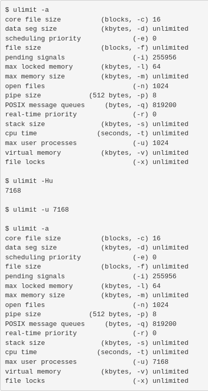
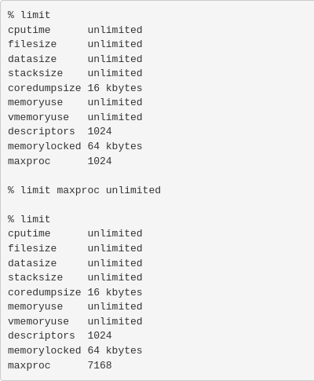
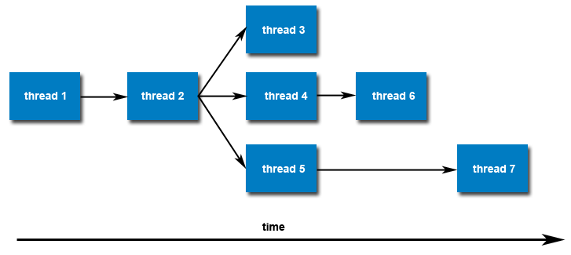

# Creating and Terminating Threads in Pthreads

## Basics

- Every program starts with **one main thread**.
- To run tasks in parallel, we must **create new threads**.
- Pthreads provides functions to **create**, **exit**, or **cancel** threads.

## Key Thread Functions

### 1. `pthread_create()`

- **Purpose**: Create a new thread.
- **Syntax**:
  ```c
  pthread_create(&thread, &attr, start_routine, arg);
  ```

### `pthread_create()` Parameters Explained

| Parameter       | Description                                                |
|----------------|------------------------------------------------------------|
| `thread`        | Pointer to a variable that will store the **thread ID** (output). |
| `attr`          | Pointer to a **thread attribute** object, or `NULL` for default settings. |
| `start_routine` | The **function** that the new thread will execute.        |
| `arg`           | **Argument** passed to the function (must be cast as `void *`). |

✅ You can call `pthread_create()` **multiple times** to create **multiple threads** that run in parallel.

### 2. `pthread_exit()`

- **Purpose**: Ends the calling thread.
- **Syntax**:
    ```c
    pthread_exit(status);
    ```
status: Optional value to return.
💡 Use this at the end of a thread function to exit cleanly.

### 3. pthread_cancel()

- **Purpose**: Asks a thread to stop running.
- **Syntax**:
    ```c
    pthread_cancel(thread);
    ```

### 4. pthread_attr_init() and pthread_attr_destroy()

- Used to create and delete thread attribute objects.
- Only needed if you're customizing thread settings.
    ```c
    pthread_attr_t attr;
    pthread_attr_init(&attr);
    // set attributes here
    pthread_attr_destroy(&attr);
    ```
### Thread Limits

- Each system has a limit on how many threads you can create.
- Going over the limit may cause errors or strange behavior.

✅ Tip:
    On Linux, you can check and change these limits using ulimit or getrlimit/setrlimit.

### Bash, Ksh, and Sh Example



### Tcsh and Csh Example



Once created, threads are peers, and may create other threads. There is no implied hierarchy or dependency between threads.


## Thread Attributes

### Default Attributes:
Each thread is created with **default attributes**. These can be customized using a **thread attribute object**.

### Important Functions:
- `pthread_attr_init(&attr);` → Initializes the attribute object.
- `pthread_attr_destroy(&attr);` → Destroys the attribute object after use.

### Modifiable Attributes:
- Detached or Joinable state
- Scheduling policy (FIFO, RR, OTHER)
- Scheduling priority and inheritance
- Stack size and address
- Guard size (for stack overflow protection)

> Some of these will be covered in detail later.

## Thread Scheduling & CPU Binding

### When and where does a thread run?
- The **OS scheduler** decides when a thread runs and on which **CPU/core**.
- Pthreads allows setting **scheduling policies** like:
  - `SCHED_FIFO` – First-In First-Out
  - `SCHED_RR` – Round Robin
  - `SCHED_OTHER` – Default system behavior

### Thread Binding (Advanced):
- Pthreads API **does not support** setting thread to specific CPUs.
- Some systems (like Linux) offer non-portable extensions:
  - `pthread_setaffinity_np()` → Non-standard, system-specific
  - `sched_setaffinity()` → Linux system call

## Terminating Threads with `pthread_exit()`

### Ways to Terminate a Thread:
1. Return from the thread function normally.
2. Call `pthread_exit()` manually.
3. Another thread cancels it with `pthread_cancel()`.
4. Process ends (e.g., calls `exit()` or `exec()`).
5. ⚠️ `main()` ends **before** threads finish — all threads terminate suddenly.

### 💡 Why use `pthread_exit()` in `main()`?
If `main()` ends early, all other threads are killed. To prevent this:
```c
int main() {
    // create threads
    pthread_exit(NULL);  // Keeps main alive until other threads finish
}
```
