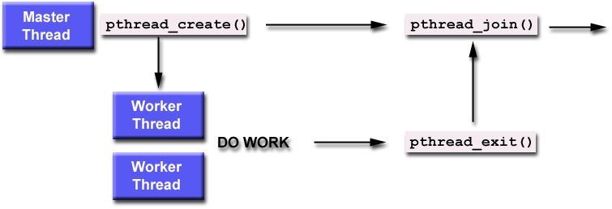

# Creating and Terminating Threads in Pthreads

## Basics

- Every program starts with **one main thread**.
- To run tasks in parallel, we must **create new threads**.
- Pthreads provides functions to **create**, **exit**, or **cancel** threads.

## Key Thread Functions

### 1. `pthread_create()`

- **Purpose**: Create a new thread.
- **Syntax**:
  ```c
  pthread_create(&thread, &attr, start_routine, arg);
  ```

### `pthread_create()` Parameters Explained

| Parameter       | Description                                                |
|----------------|------------------------------------------------------------|
| `thread`        | Pointer to a variable that will store the **thread ID** (output). |
| `attr`          | Pointer to a **thread attribute** object, or `NULL` for default settings. |
| `start_routine` | The **function** that the new thread will execute.        |
| `arg`           | **Argument** passed to the function (must be cast as `void *`). |

✅ You can call `pthread_create()` **multiple times** to create **multiple threads** that run in parallel.

### 2. `pthread_exit()`

- **Purpose**: Ends the calling thread.
- **Syntax**:
    ```c
    pthread_exit(status);
    ```
status: Optional value to return.
💡 Use this at the end of a thread function to exit cleanly.

### 3. pthread_cancel()

- **Purpose**: Asks a thread to stop running.
- **Syntax**:
    ```c
    pthread_cancel(thread);
    ```

### 4. pthread_attr_init() and pthread_attr_destroy()

- Used to create and delete thread attribute objects.
- Only needed if you're customizing thread settings.
    ```c
    pthread_attr_t attr;
    pthread_attr_init(&attr);
    // set attributes here
    pthread_attr_destroy(&attr);
    ```
### Thread Limits

- Each system has a limit on how many threads you can create.
- Going over the limit may cause errors or strange behavior.

✅ Tip:
    On Linux, you can check and change these limits using ulimit or getrlimit/setrlimit.

### Bash, Ksh, and Sh Example


### Tcsh and Csh Example


Once created, threads are peers, and may create other threads. There is no implied hierarchy or dependency between threads.


## Thread Attributes

### Default Attributes:
Each thread is created with **default attributes**. These can be customized using a **thread attribute object**.

### Important Functions:
- `pthread_attr_init(&attr);` → Initializes the attribute object.
- `pthread_attr_destroy(&attr);` → Destroys the attribute object after use.

### Modifiable Attributes:
- Detached or Joinable state
- Scheduling policy (FIFO, RR, OTHER)
- Scheduling priority and inheritance
- Stack size and address
- Guard size (for stack overflow protection)

> Some of these will be covered in detail later.

## Thread Scheduling & CPU Binding

### When and where does a thread run?
- The **OS scheduler** decides when a thread runs and on which **CPU/core**.
- Pthreads allows setting **scheduling policies** like:
  - `SCHED_FIFO` – First-In First-Out
  - `SCHED_RR` – Round Robin
  - `SCHED_OTHER` – Default system behavior

### Thread Binding (Advanced):
- Pthreads API **does not support** setting thread to specific CPUs.
- Some systems (like Linux) offer non-portable extensions:
  - `pthread_setaffinity_np()` → Non-standard, system-specific
  - `sched_setaffinity()` → Linux system call

## Terminating Threads with `pthread_exit()`

### Ways to Terminate a Thread:
1. Return from the thread function normally.
2. Call `pthread_exit()` manually.
3. Another thread cancels it with `pthread_cancel()`.
4. Process ends (e.g., calls `exit()` or `exec()`).
5. ⚠️ `main()` ends **before** threads finish — all threads terminate suddenly.

### 💡 Why use `pthread_exit()` in `main()`?
If `main()` ends early, all other threads are killed. To prevent this:
```c
int main() {
    // create threads
    pthread_exit(NULL);  // Keeps main alive until other threads finish
}
```

# Passing Arguments to Threads in Pthreads

## Basic Concept
- `pthread_create()` only supports **one argument** passed to the thread's function.
- This argument must be passed **by reference** and cast to `(void *)`.

### What if you need multiple arguments?
- Combine the values into a `struct`.
- Pass a **pointer to the struct**.
- Inside the thread function, cast it back to the original struct type.

### Example
```c
#include <pthread.h>
#include <stdio.h>

typedef struct {
    int id;
    char *message;
} ThreadArgs;

void *printMessage(void *arg) {
    ThreadArgs *args = (ThreadArgs *)arg;
    printf("Thread %d says: %s\n", args->id, args->message);
    return NULL;
}

int main() {
    pthread_t tid;
    ThreadArgs args = {1, "Hello from thread!"};
    
    pthread_create(&tid, NULL, printMessage, (void *)&args);
    pthread_exit(NULL);  // Wait for the thread to finish
}
```
## ❓ Question: How to Safely Pass Data to Threads?

### ⚠️ Problem

Threads can start executing at **any time**, so if you:
- Pass the **address of a local variable** that gets modified,
- Or **reuse a single struct** for multiple threads,

You might get **unexpected behavior**, because threads may access **outdated or overwritten** data.

### ✅ Safe Approaches

- **Use separate structs for each thread**  
  Allocate a **unique struct per thread** to avoid shared data issues.

- **Dynamically allocate memory for each thread**  
  Use `malloc()` to allocate memory for each thread’s data.  
  ✅ Remember to `free()` it inside the thread function when it's no longer needed.

```c
ThreadArgs *args = malloc(sizeof(ThreadArgs));
args->id = 1;
args->message = "Safe thread data!";
pthread_create(&tid, NULL, threadFunction, (void *)args);
```
- **Avoid modifying the argument after creating the thread**  
  If you pass the address of a global or shared variable, don't change it until the thread finishes using it.


# Joining and Detaching Threads (Pthreads)

### Routines:

```c
pthread_join(thread, status)

pthread_detach(thread)

pthread_attr_setdetachstate(attr, detachstate)

pthread_attr_getdetachstate(attr)
```
## pthread_join()

- Used to **wait for a thread to finish**.
- It **blocks the calling thread** until the specified thread ends.
- Can retrieve the **exit status** of the thread (if given using `pthread_exit()`).



### Important:
- A thread can be **joined only once**.
- Trying to join a thread **multiple times = logical error**.

## Joinable vs Detached Threads

### Joinable Thread:
- Can be joined using `pthread_join()`.
- Default behavior (but not guaranteed in all systems).
- Use when you want to wait for the thread to finish.

### Detached Thread:
- **Cannot be joined**.
- Resources are **automatically cleaned up** when thread ends.
- Use when **you don’t need** to wait for the thread.


## Making a Thread Detached (4-step process)

```c
pthread_attr_t attr;
pthread_attr_init(&attr);                          // 1. Init
pthread_attr_setdetachstate(&attr, PTHREAD_CREATE_DETACHED); // 2. Set as detached
pthread_create(&thread, &attr, function, arg);     // 3. Create thread with attr
pthread_attr_destroy(&attr);                       // 4. Clean up
```

## Detach a Thread After Creation
```c
pthread_detach(pthread_self());  // Detach current thread
```
- Only use if thread was created as joinable and you now want to detach it.

- ⚠️ There's no way to reverse detachment.


# Stack Management in POSIX Threads

## What is the Thread Stack?

Each thread in a program gets its own **stack memory** for:
- Local variables
- Function calls

If the stack is too small, it can cause:
- Program crashes  
- Corrupted data

## ⚠️ Problem: Stack Size is Not Fixed

- **POSIX** does **not define a default stack size**
- Default stack size depends on:
  - The system (e.g., Linux, macOS)
  - The number of threads
- Default size may be **too small** for deep recursion or large local arrays

## Safe Stack Management

### Set Stack Size Manually

Use `pthread_attr_setstacksize()` to define a safe, custom stack size:

```c
pthread_attr_t attr;
pthread_attr_init(&attr);
pthread_attr_setstacksize(&attr, desired_size_in_bytes);
```
## Setting Stack Address (Advanced Use)

- In special systems, threads may need their **stack memory in a specific region**.
- POSIX provides two routines for this purpose:

### Functions

```c
int pthread_attr_setstackaddr(pthread_attr_t *attr, void *stackaddr);
int pthread_attr_getstackaddr(pthread_attr_t *attr, void **stackaddr);
```
- pthread_attr_setstackaddr() — manually sets the start address of the thread stack.
- pthread_attr_getstackaddr() — gets the current stack address from attributes.

### ⚠️ Note: This is an advanced feature. Use only when:

- Required by system-specific constraints.
- Working on embedded systems or low-level memory-tuned applications.

### 🖥️ Practical Notes from Livermore Computing (LC)


# Miscellaneous Routines

## 🔹 `pthread_self()`
- Returns the **unique thread ID** of the calling thread.
- Useful when a thread wants to identify itself.

```c
pthread_t tid = pthread_self();
```

## 🔹 `pthread_equal(thread1, thread2)`
- Compares two thread IDs.
- Returns:
  - 0 if they are different
  - Non-zero if they are equal

- ✅ Do NOT use == to compare threads. Always use pthread_equal.

```c
if (pthread_equal(t1, t2)) {
    printf("Same thread\n");
}
```
## 🔹 Why `==` Should Not Be Used
- Thread IDs are opaque — you can't see or compare their internal values directly.
- Always use pthread_equal for safe comparison.

## 🔹 `pthread_once(once_control, init_routine)`
- Ensures that init_routine is executed only once, even if called by multiple threads.
- Typically used for safe, one-time initialization.

💡 How to Use
```c
pthread_once_t once_control = PTHREAD_ONCE_INIT;

void init_function() {
    // Initialization code
}

pthread_once(&once_control, init_function);
```
- ✅ Only the first thread runs init_function
- 🚫 All other threads skip it